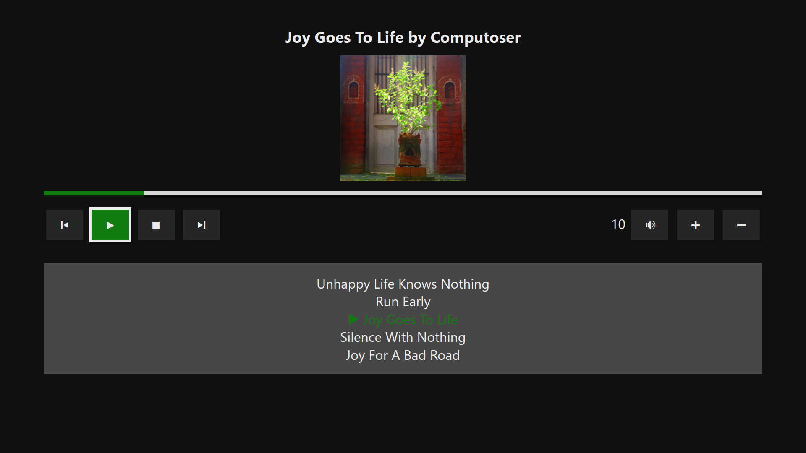

# Web-based Xbox video app sample

A mini music player app meant to be run on Xbox. The UI is written in HTML and JavaScript running in a full-screen WebView. The app uses a short list of hard-coded tracks rather than a webservice, but may be suitable to use as a jumping-off point for building a more full-featured app. It also utilizes a small JavaScript library which may be independently useful, redirectconsole-1.0.0.0.js, which aids in debugging JavaScript code running in a WebView in versions of Visual Studio greater than 2017.

> Note - This sample is targeted and tested for Windows 11 (10.0; Build 22000), and Visual Studio 2017. If you prefer, you can use project properties to retarget the project(s) to Windows 10, version 2104 (10.0; Build 20348).

This sample runs on the Universal Windows Platform (UWP). 

## Features

This sample highlights the following topics:

* [Xbox best practices](https://docs.microsoft.com/windows/uwp/xbox-apps/tailoring-for-xbox)
* [WebView](https://docs.microsoft.com/uwp/api/Windows.UI.Xaml.Controls.WebView) ([Windows.UI.Xaml.Controls](https://docs.microsoft.com/uwp/api/windows.ui.xaml.controls))
* Using [WebView.ScriptNotify](https://docs.microsoft.com/uwp/api/windows.ui.xaml.controls.webview.scriptnotify)
* Using [WebView.AddWebAllowedObject](https://docs.microsoft.com/en-us/uwp/api/windows.ui.xaml.controls.webview.addweballowedobject)
* [MediaPlayer playback](https://docs.microsoft.com/en-us/windows/uwp/audio-video-camera/play-audio-and-video-with-mediaplayer)
* [Background media playback](https://docs.microsoft.com/en-us/windows/uwp/audio-video-camera/background-audio)

## Universal Windows Platform development

### Prerequisites

- Windows 10 or 11. Minimum: Windows 10, version 1809 (10.0; Build 17763), also known as the Windows 10 October 2018 Update.
- [Windows SDK](https://developer.microsoft.com/windows/downloads/windows-sdk/). Minimum: Windows SDK version 10.0.17763.0 (Windows 10, version 1809).
- [Visual Studio 2017](https://visualstudio.microsoft.com/vs/older-downloads/) You can use the free Visual Studio Community Edition to build and run Windows Universal Platform (UWP) apps. Visual Studio 2019 or 2022 can be used as well, but lack script debugging tools for WebView, so they are not recommended.

To get the latest updates to Windows and the development tools, and to help shape their development, join 
the [Windows Insider Program](https://insider.windows.com).

## Running the sample

You can simply hit Start Debugging (F5) to try this sample on your local machine.

To test the app on an Xbox, you will need to enable [Developer Mode on your Xbox](https://docs.microsoft.com/windows/uwp/xbox-apps/devkit-activation). Then you can configure Visual Studio to deploy to it as a Remote Machine:
1. Right-click the main project in the Solution Explorer, and then select Properties.
2. Under Start options, change Target device to Remote Machine.
3. In Remote machine, enter the system IP address or hostname of the Xbox One console. For information about obtaining the IP address or hostname, see [Introduction to Xbox One tools](https://docs.microsoft.com/windows/uwp/xbox-apps/introduction-to-xbox-tools).
4. In the Authentication Mode drop-down list, select Universal (Unencrypted Protocol).

When you next hit Start Debugging (F5) it may ask you for a pairing PIN. This can be found in the [Dev Home app](https://docs.microsoft.com/windows/uwp/xbox-apps/dev-home) on your Xbox.

## Code at a glance

If you're just interested in code snippets for certain APIs and don't want to browse or run the full sample, check out the following files for examples of some highlighted features:

* [App.xaml.cs](JavaScriptMusicSample/App.xaml.cs#L35)
    - Disabling mouse mode using `this.RequiresPointerMode = ApplicationRequiresPointerMode.WhenRequested`.
	- Releasing the UI when the app enters the background in `OnEnteredBackground()`.
	- Recreating the UI when the app leaves the background in `OnLeavingBackground()`.
* [MainPage.xaml.cs](JavaScriptMusicSample/MainPage.xaml.cs#L12)
	- Calling `ApplicationView.GetForCurrentView().SetDesiredBoundsMode()` to allow the app to draw all the way to the edges of the screen.
    - Calling `ApplicationViewScaling.TrySetDisableLayoutScaling()` to disable the automatic 2X scaling UWP apps get by default on Xbox.
    - Constructing a `WebView` manually and adding it to the scene once `NavigationCompleted` has fired.
    - Logging the contents of `ScriptNotify` events to the console. This pairs with [redirectconsole-1.0.0.0.js](JavaScriptMusicSample/WebCode/libs/redirectconsole-1.0.0.0.js) and is useful on Visual Studio versions greater than 2017. On Visual Studio 2017, this can be removed.
* [MediaPlaybackController.cs](JavaScriptMusicSample.Projected/MediaPlaybackController.cs#L24)
    - Using the `[AllowForWeb]` attribute to project a C# class into JavaScript.
	- Providing an interface for the JavaScript code to interface with `MediaPlayer` so it can manage playback.
* [music-player.html](JavaScriptMusicSample/WebCode/music-player.html#L8)
    - Using [directionalnavigation-1.0.0.0.js](JavaScriptMusicSample/WebCode/libs/directionalnavigation-1.0.0.0.js) (which comes from a separate project, [TVHelpers](https://github.com/Microsoft/TVHelpers)) to enable focus navigation using the Xbox controller.
    - Implementing all of the app's UI using HTML5, JavaScript, and CSS.
* [redirectconsole-1.0.0.0.js](JavaScriptMusicSample/WebCode/libs/redirectconsole-1.0.0.0.js)
    - Redirecting `console.log`, `console.info`, `console.warn`, and `console.error` to `window.external.notify` so that it can be caught in C# via the `ScriptNotify` event and logged to the C# console. Note that this is only helpful on versions of Visual Studio greater than 2017; Visual Studio 2017 has comprehensive script debugging tools which are more detailed than simply logging them to the C# console.

## Trademarks

This project may contain trademarks or logos for projects, products, or services. Authorized use of Microsoft 
trademarks or logos is subject to and must follow 
[Microsoft's Trademark & Brand Guidelines](https://www.microsoft.com/en-us/legal/intellectualproperty/trademarks/usage/general).
Use of Microsoft trademarks or logos in modified versions of this project must not cause confusion or imply Microsoft sponsorship.
Any use of third-party trademarks or logos are subject to those third-party's policies.