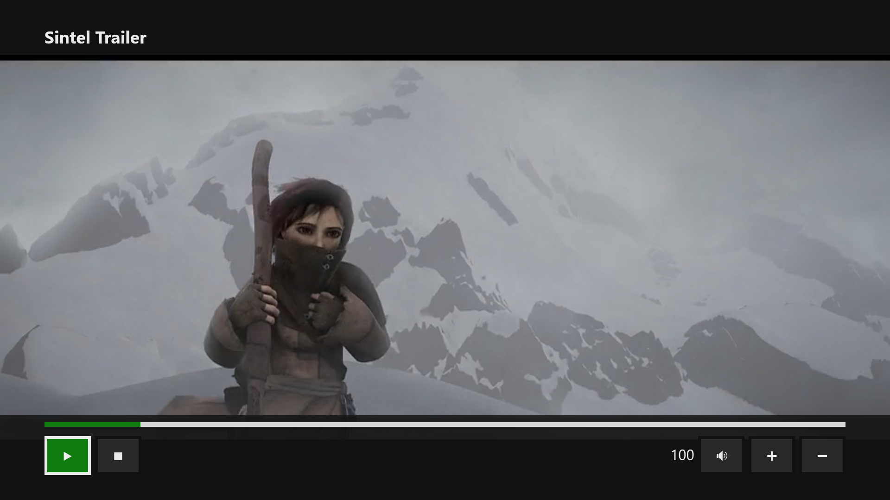

# Web-based Xbox video app sample

A mini video player app meant to be run on Xbox, built primarily in JavaScript and HTML, running in a thin native wrapper containing a full-screen WebView. The app is hard-coded to a single video, and provides only very basic playback functionality, but may be suitable to use as a jumping-off point for building a similar app.

> Note - This sample is targeted and tested for Windows 11 (10.0; Build 22000), and Visual Studio 2022.

This sample runs on the Universal Windows Platform (UWP). 

## Features

This sample highlights the following topics:

* [Xbox best practices](https://docs.microsoft.com/windows/uwp/xbox-apps/tailoring-for-xbox)
* [WebView2](https://learn.microsoft.com/en-us/microsoft-edge/webview2/concepts/overview-features-apis)
* [Projecting WinRT APIs into JavaScript](https://learn.microsoft.com/en-us/microsoft-edge/webview2/how-to/winrt-from-js)
* [Calling JavaScript code from native-side code](https://learn.microsoft.com/en-us/microsoft-edge/webview2/how-to/javascript)
* Keeping the [SystemMediaTransportControls](https://learn.microsoft.com/en-us/windows/uwp/audio-video-camera/system-media-transport-controls) up-to-date and responding to Media Remote button presses

## Universal Windows Platform development

### Prerequisites

- Windows 11. Minimum: Windows 11, version 22H2 (updated Oct 2023).
- [Windows SDK](https://developer.microsoft.com/windows/downloads/windows-sdk/). Minimum: Windows SDK version 10.0.22621 (Windows 11, version 22H2).
- [Visual Studio 2022](https://visualstudio.microsoft.com/) You can use the free Visual Studio Community Edition to build and run Windows Universal Platform (UWP) apps.

To get the latest updates to Windows and the development tools, and to help shape their development, join the [Windows Insider Program](https://insider.windows.com).

## Running the sample

You can simply hit Start Debugging (F5) to try this sample on your local machine.

To test the app on an Xbox, you will need to enable [Developer Mode on your Xbox](https://docs.microsoft.com/windows/uwp/xbox-apps/devkit-activation). Then you can configure Visual Studio to deploy to it as a Remote Machine:
1. Right-click the main project in the Solution Explorer, and then select Properties.
2. Under Start options, change Target device to Remote Machine.
3. In Remote machine, enter the system IP address or hostname of the Xbox One console. For information about obtaining the IP address or hostname, see [Introduction to Xbox One tools](https://docs.microsoft.com/windows/uwp/xbox-apps/introduction-to-xbox-tools).
4. In the Authentication Mode drop-down list, select Universal (Unencrypted Protocol).

When you next hit Start Debugging (F5) it may ask you for a pairing PIN. This can be found in the [Dev Home app](https://docs.microsoft.com/windows/uwp/xbox-apps/dev-home) on your Xbox.

## Code at a glance

If you're just interested in code snippets for certain APIs and don't want to browse or run the full sample, check out the following files for examples of some highlighted features:

* [App.cpp](/WebView2/cpp/JavaScriptVideoSample/JavaScriptVideoSample/App.cpp#L39)
    - Disabling mouse mode using `RequiresPointerMode(ApplicationRequiresPointerMode::WhenRequested)`.
* [MainPage.cpp](/WebView2/cpp/JavaScriptVideoSample/JavaScriptVideoSample/MainPage.cpp#L42)
	- Calling `ApplicationView::GetForCurrentView().SetDesiredBoundsMode(ApplicationViewBoundsMode::UseCoreWindow)` to allow the app to draw all the way to the edges of the screen.
    - Calling `ApplicationViewScaling::TrySetDisableLayoutScaling()` to disable the automatic 2X scaling UWP apps get by default on Xbox.
    - Constructing a `WebView2` manually and adding it to the scene once `NavigationCompleted` has fired.
    - Calling `CoreWebView2::SetVirtualHostNameToFolderMapping()` to allow the WebView2 to load webpages found inside the app package.
    - Calling `CoreWebView2::AddHostObjectToScript()` to provide access to some WinRT APIs to the JavaScript running in the Web View.
    - Calling `CoreWebView2::AddScriptToExecuteOnDocumentCreatedAsync()` to provide some setup JavaScript code for the marshalled object.
    - Receiving JSON messages from the JavaScript code and using them to keep the `SystemMediaTransportControls` up to date.
    - Calling JavaScript functions from the native code using `WebView2::ExecuteScriptAsync()`.
* [video-player.html](/WebView2/WebCode/video-player.html#L13)
    - Using [directionalnavigation-1.0.0.0.js](/WebView2/WebCode/libs/directionalnavigation-1.0.0.0.js) (which comes from a separate project, [TVHelpers](https://github.com/Microsoft/TVHelpers)) to enable focus navigation using the Xbox controller.
    - Implementing all of the app's UI and playback using HTML5, JavaScript, and CSS.
    - Sending messages back to the native-side code using `window.chrome.webview.postMessage()`.
* [uwpdisplaymode.js](/WebView2/WebCode/uwpdisplaymode.js)
    - Calling into WinRT APIs to query the attached device's display capabilities, and setting its display mode to play different types of content.

## Trademarks

This project may contain trademarks or logos for projects, products, or services. Authorized use of Microsoft 
trademarks or logos is subject to and must follow 
[Microsoft's Trademark & Brand Guidelines](https://www.microsoft.com/en-us/legal/intellectualproperty/trademarks/usage/general).
Use of Microsoft trademarks or logos in modified versions of this project must not cause confusion or imply Microsoft sponsorship.
Any use of third-party trademarks or logos are subject to those third-party's policies.